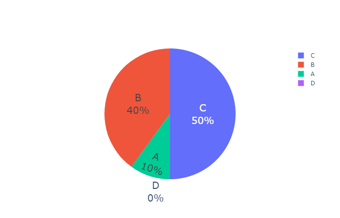

# Genetic Algorithm
I am presenting my engineering thesis on the topic: "Framework preparation for the project to search for new two-dimensional materials using global optimization methods" 
 
We assign the genetic algorithm to the thick of heuristic algorithms. It is used to search for the best solution of a goal function using methods based on the mechanisms of evolution and natural selection. Genetic algorithms are of growing interest due to their low complexity and at the same time they are a powerful tool for finding new solutions. Another advantage is that genetic algorithms are free from strong constraints - such as continuity, existence of derivatives and unimodality of the objective function.
 
The algorithm uses the following natural selection mechanisms:
1. Mutation - involves randomly changing one gene in a chromosome. A mutation increases the diversity of genetic material. The probability of a mutation occurring is declared at the start of the program. Its value should not be too high, because too much randomness will appear in the algorithm. In my work, mutation is implemented by a minimal change in atomic positions. In my work the mutation method will be performed using the Roulette Wheel Method, which is described below. 
2. Crossover - generates a new population of individuals. It involves cutting the chromosomes of the parents at any point and crossing them over to produce two offspring. In my work, I implement the crossover method by swapping places of random atoms in a structure.
3. Selection - consists in choosing the strongest individuals (those with the best objective function) and letting them pass to the next generation - the next iteration of the program. In my work, selection is applied to a declared percentage of the best individuals in a population.
 
### Choice by Roulette Wheel Method
The Roulette Wheel method involves selecting the best individuals. The idea is taken from the roulette wheel with which we are all familiar. Each individual has its own area of the circle segment proportional to the value of the objective function. An individual with the best objective function will have the largest area, and similarly an individual with the weakest objective function will have the smallest area, and therefore the smallest chance of being selected.

